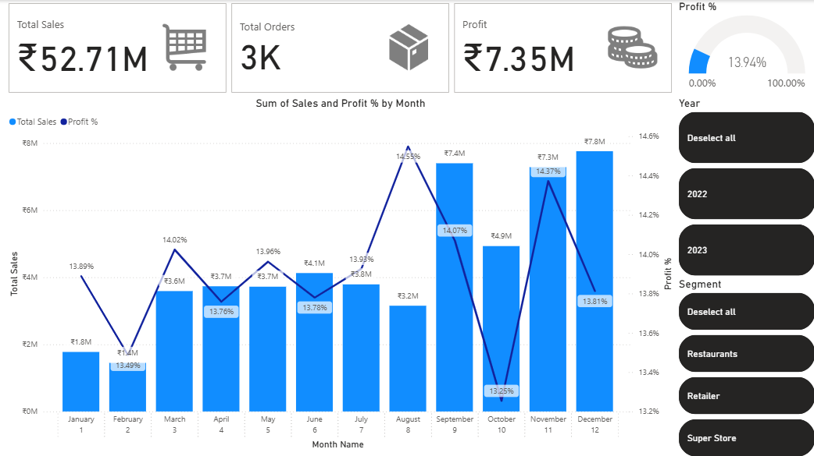
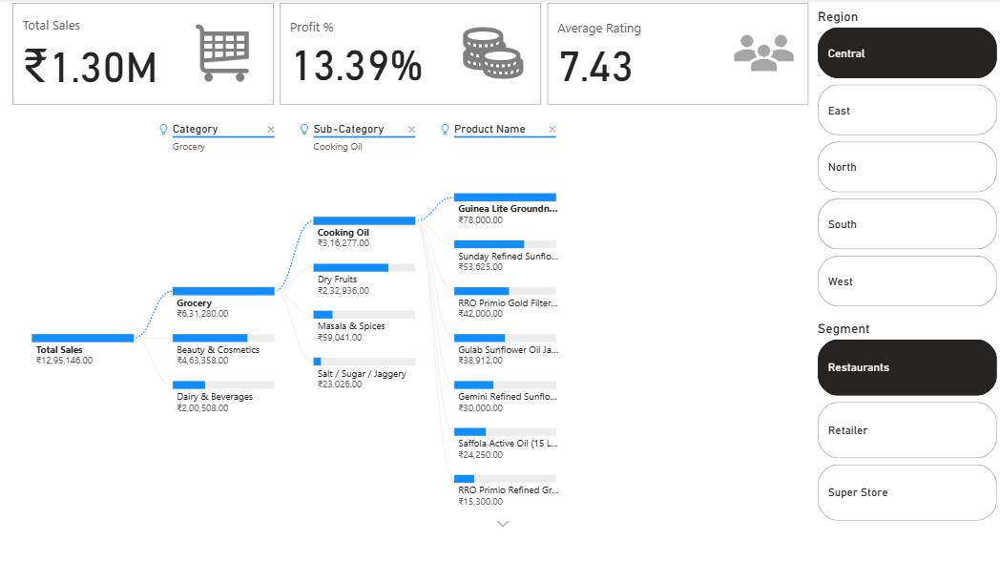
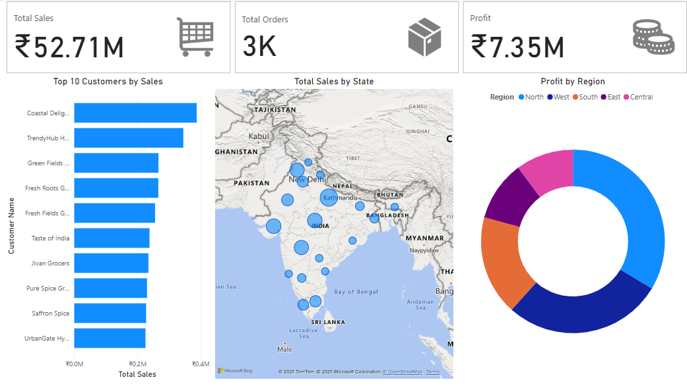

# 📊 NationalStore Sales Dashboard – Power BI Project

## 📌 Overview
This project focuses on analyzing **NationalStore’s business health** by tracking **Key Performance Indicators (KPIs)** related to **sales, profitability, product hierarchy, and regional performance**.  
The analysis is powered by **Power BI**, incorporating a complete **ETL (Extract, Transform, Load) process**, calculated DAX measures, and interactive dashboards for actionable insights.

---

## 🎯 Objectives
- Track **sales trends** and **profitability** over time.
- Understand **regional sales performance**.
- Analyze **product hierarchy** to identify best-selling categories.
- Provide stakeholders with **data-driven insights** for better decision-making.

---

## 🗂 Dataset
The analysis uses the following CSV files:
- **NationalStore - SalesTable.csv** – Transactional sales data.
- **NationalStore - ProductTable.csv** – Product category and subcategory details.
- **NationalStore - DateTable.csv** – Date dimension for time-based analysis.

---

## ⚙️ ETL Process in Power BI
**1. Extract**
- Imported CSV files into Power BI Desktop.

**2. Transform (Power Query)**
- Removed data errors from the sales table.
- Assigned correct data types for each column.
- Enhanced the Date Table with **Month Name**, **Month Number**, and **Year** columns.

**3. Load**
- Loaded the cleaned and transformed data into Power BI for visualization.

---

## 📐 Data Model
- Relationships built between **Sales**, **Products**, and **Date** tables.
- Calculated **DAX measures** and columns for advanced analysis.

---

## 📊 Dashboards
### 1️⃣ Monthly Sales / Profit%
- Visualizes month-wise sales trends and profit percentages.

### 2️⃣ Sales by Product Hierarchy
- Breaks down sales performance by **Category** and **Subcategory**.

### 3️⃣ Regional Performance
- Displays geographical sales distribution and profitability.

---

## 🛠 Tools & Technologies
- **Power BI Desktop**
- **Power Query**
- **DAX (Data Analysis Expressions)**
- **CSV Datasets**

---

## 📌 Outcomes
- Clear visibility into **sales & profit performance**.
- Insights into **high-performing products and regions**.
- Better decision-making for **sales strategy & inventory planning**.

---

## 📷 Dashboard Screenshots
 
 
 

